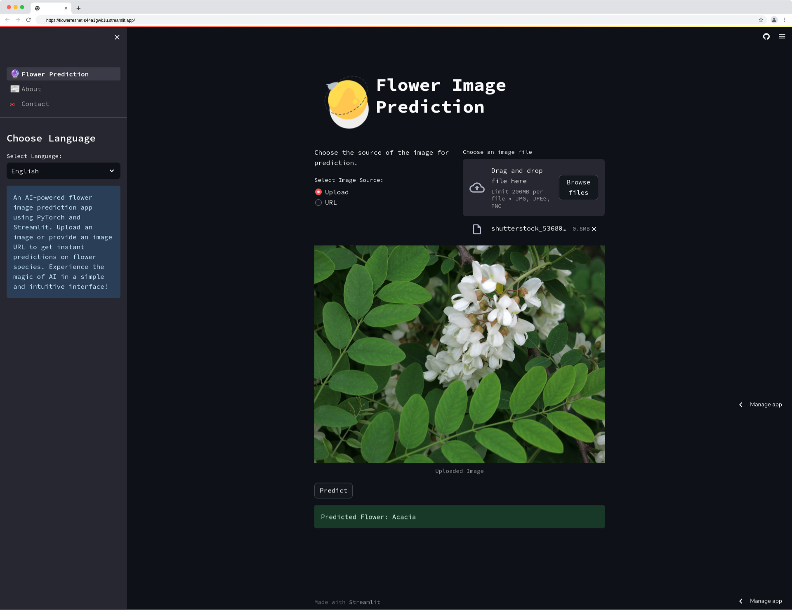

# FlowerResNet

This GitHub project showcases the classification of flower images using a custom ResNet model implemented in PyTorch. The Flowers-299 dataset, consisting of 299 flower classes, is utilized for training and evaluation. The project covers various aspects including data preprocessing, model training with SGD optimizer, validation, and model checkpointing for reusability.

## Features
- Custom ResNet model for flower image classification
- Data preprocessing with resizing, normalization, and augmentation
- Training using Stochastic Gradient Descent (SGD) optimizer
- Validation during training for monitoring model performance
- Checkpointing to save and load model for future use

## Demo  
  

## Accuracy and Loss Graphs 
  

## Usage
To run the Streamlit application download the model and put it in the base diractry and runthe command.

~~~bash  
    Streamlit run Streamlit_app.py
~~~
## Usage
To use this project, follow these steps:

1. Clone the repository and install the required dependencies.

    ~~~bash  
        pip install -r requirements.txt
    ~~~
2. Prepare the dataset:
   - Download the Flowers-299 dataset and place it in the `data/flowers-299` directory.
   - Ensure the dataset is structured with separate folders for each class.

3. Train the model:
   - Adjust the hyperparameters in the training script according to your requirements.
   - Start the training process.

    ~~~bash  
        python train.py
    ~~~

4. Evaluate the model:
   - Adjust the paths in the evaluation script to point to the trained model checkpoint and test dataset.
   - Run the evaluation script to assess the model's performance on the test dataset.

    ~~~bash  
        python evaluate.py
    ~~~

5. Use the model for predictions:
   - Adjust the paths in the prediction script to point to the trained model checkpoint and the image you want to classify.
   - Run the prediction script to make predictions using the trained model.

    ~~~bash  
        python predict.py
    ~~~
## Contributing
Contributions are welcome! Please open an issue or submit a pull request for any enhancements or bug fixes.

## Acknowledgements
We would like to thank the creators of the Flowers-299 dataset for providing the valuable data for this project.

## References
- [ResNet Paper](https://arxiv.org/abs/1512.03385)
- [PyTorch](https://pytorch.org/)
- [Flowers-299 Dataset](https://www.kaggle.com/datasets/bogdancretu/flower299)